```dot
digraph mygraph {
    "matplotlib" -> "libjs-jquery";
    "matplotlib" -> "libjs-jquery-ui";
    "matplotlib" -> "python-matplotlib-data";
    "matplotlib" -> "python3-dateutil";
    "matplotlib" -> "python3-pil.imagetk";
    "matplotlib" -> "python3-pyparsing";
    "matplotlib" -> "python3-six";
    "matplotlib" -> "python3-numpy";
    "matplotlib" -> "python3-numpy-abi9";
    "matplotlib" -> "python3";
    "matplotlib" -> "python3";
    "matplotlib" -> "python3-cycler";
    "matplotlib" -> "python3-fonttools";
    "matplotlib" -> "python3-kiwisolver";
    "matplotlib" -> "python3-packaging";
    "matplotlib" -> "python3-pil";
    "matplotlib" -> "python3:any";
    "matplotlib" -> "libc6";
    "matplotlib" -> "libfreetype6";
    "matplotlib" -> "libgcc-s1";
    "matplotlib" -> "libqhull-r8.0";
    "matplotlib" -> "libstdc++6";
}
```

## Задача 1

Вывести служебную информацию о пакете matplotlib (Python). Разобрать основные элементы содержимого файла со служебной информацией из пакета. Как получить пакет без менеджера пакетов, прямо из репозитория?

### Решение:

```bash
apt show python3-matplotlib
```


## Задача 2

Вывести служебную информацию о пакете express (JavaScript). Разобрать основные элементы содержимого файла со служебной информацией из пакета. Как получить пакет без менеджера пакетов, прямо из репозитория?

### Решение:

```bash
apt show node-express
```


## Задача 3

Сформировать graphviz-код и получить изображения зависимостей matplotlib и express.

### Решение:







```dot
digraph mygraph {
    "express" -> "node-accepts";
    "express" -> "node-array-flatten";
    "express" -> "node-body-parser";
    "express" -> "node-content-disposition";
    "express" -> "node-content-type";
    "express" -> "node-cookie";
    "express" -> "node-cookie-signature";
    "express" -> "node-debug";
    "express" -> "node-depd";
    "express" -> "node-encodeurl";
    "express" -> "node-escape-html";
    "express" -> "node-etag";
    "express" -> "node-finalhandler";
    "express" -> "node-fresh";
    "express" -> "node-merge-descriptors";
    "express" -> "node-methods";
    "express" -> "node-on-finished";
    "express" -> "node-parseurl";
    "express" -> "node-path-to-regexp";
    "express" -> "node-proxy-addr";
    "express" -> "node-qs";
    "express" -> "node-range-parser";
    "express" -> "node-safe-buffer";
    "express" -> "node-send";
    "express" -> "node-serve-static";
    "express" -> "node-setprototypeof";
    "express" -> "node-statuses";
    "express" -> "node-type-is";
    "express" -> "node-utils-merge";
    "express" -> "node-vary";
    "express" -> "nodejs:any";
}
```

## Задача 4

Изучить основы программирования в ограничениях. Установить MiniZinc, разобраться с основами его синтаксиса и работы в IDE.

Решить на MiniZinc задачу о счастливых билетах. Добавить ограничение на то, что все цифры билета должны быть различными (подсказка: используйте all_different). Найти минимальное решение для суммы 3 цифр.

### Решение:

```MiniZinc
include "alldifferent.mzn";

var 0..9: a;
var 0..9: b;
var 0..9: c;
var 0..9: d;
var 0..9: e;
var 0..9: f;

constraint a + b + c == d + e + f;

constraint alldifferent([a,b,c,d,e,f]);

solve minimize a + b + c;
```


## Задача 5

Решить на MiniZinc задачу о зависимостях пакетов для рисунка, приведенного ниже.


### Решение: 

```MiniZinc
array [0..1] of var 0..1: icons;
array [0..5] of var 0..1: menu;
array [0..4] of var 0..1: dropdown;

var 0..1: ic;
var 0..5: me;
var 0..4: dr;

constraint sum(icons) <= 1;
constraint sum(menu) <= 1;
constraint sum(dropdown) <= 1;

constraint icons[1] == 0;
constraint menu[0] + menu[5] >= 1;

constraint menu[0] <= dropdown[0];
constraint forall (i in 1..5) (menu[i] <= dropdown[4] + dropdown[1]);

constraint forall (i in 1..4) (dropdown[i] <= icons[1]);


constraint forall(i in 0..1) (
  if icons[i] == 1
  then ic=i
  else true
  endif
);

constraint forall(i in 0..5) (
  if menu[i] == 1
  then me=i
  else true
  endif
);

constraint forall(i in 0..4) (
  if dropdown[i] == 1
  then dr=i
  else true
  endif
);

output [
"icons version: ", show(ic), "\n",
"menu version: ", show(me), "\n",
"dropdown version: ", show(dr)
];
```


## Задача 6

Решить на MiniZinc задачу о зависимостях пакетов для следующих данных:

```
root 1.0.0 зависит от foo ^1.0.0 и target ^2.0.0.
foo 1.1.0 зависит от left ^1.0.0 и right ^1.0.0.
foo 1.0.0 не имеет зависимостей.
left 1.0.0 зависит от shared >=1.0.0.
right 1.0.0 зависит от shared <2.0.0.
shared 2.0.0 не имеет зависимостей.
shared 1.0.0 зависит от target ^1.0.0.
target 2.0.0 и 1.0.0 не имеют зависимостей.
```

### Решение:

```MiniZinc
var 0..1: foo_min;
var 1..9: foo_maj;

var 0..9: target_min;
var 1..9: target_maj;

var 0..9: left_min;
var 1..9: left_maj;

var 0..9: right_min;
var 1..9: right_maj;

var 0..9: shared_min;
var 1..9: shared_maj;

constraint foo_maj == 1;

constraint target_maj == 2;

constraint (
if foo_min == 1
then left_maj = 1 /\ right_maj = 1
else true
endif
);

constraint (
if left_maj == 1
then shared_maj >= 1
else true
endif
);

constraint (
if right_maj == 1
then shared_maj < 2
else true
endif
);

constraint (
if shared_maj == 1
then target_maj = 1
else true
endif
);

output [
"foo ", show(foo_maj), ".", show(foo_min), ".0\n",
"target ", show(target_maj), ".", show(target_min), ".0\n",
"left ", show(left_maj), ".", show(left_min), ".0\n",
"right ", show(right_maj), ".", show(right_min), ".0\n",
"shared ", show(shared_maj), ".", show(shared_min), ".0"
];
```


## Задача 7

Представить на MiniZinc задачу о зависимостях пакетов в общей форме, чтобы конкретный экземпляр задачи описывался только своим набором данных.

### Решение задачи выполнено в отдельном репозитории:

**[Depend_solver](https://github.com/Arsenoks4132/depend_solver)**
